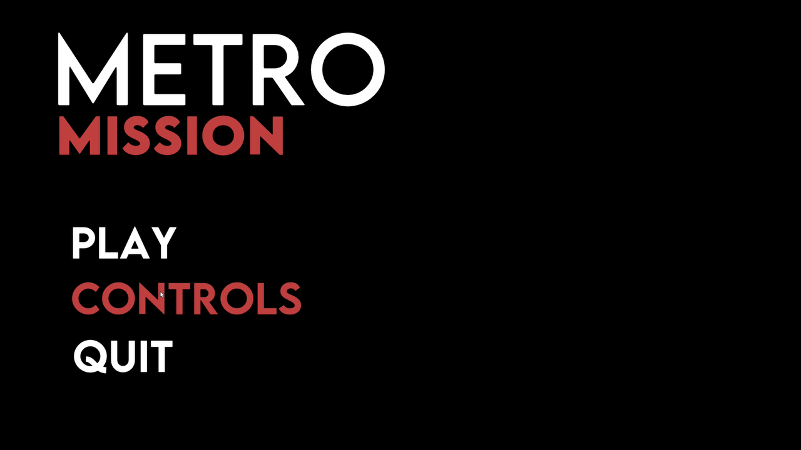

# Missile Run

A small 3D game built in Unity where you control a guided missile flying through an underground tunnel system. Your goal is to reach the target at the end of each level without colliding with the walls or obstacles.

## Overview
This project was created to learn the fundamentals of Unity game development, including scene management, physics, and collision detection.
All 3D models were designed in Blender, and the gameplay runs on C# using Unity's built in components.  
 

## Gameplay
- Control a missile navigating through partly abandoned underground system
- Reach the target to progress to the next level
- Collide with anything else and you explode
- The difficulty increases over the three playable levels  
 

## Features
- Level progression and restart system
- Main menu and controls page
- Particle effects and explosion animation
- Sound effects for missile, explosion, and success
- Custom 3D assets made in Blender  
 

## Technical Details
Built with Unity (C#)  
assets created in Blender

## Give it a try
Navigate to latest release [here](https://github.com/filipek-0/Missile-Run/releases) and follow the instructions

## Possible Future Improvements
- Add background music
- Implement score tracking
- Add new level designs and improve UI
- Improve physics
